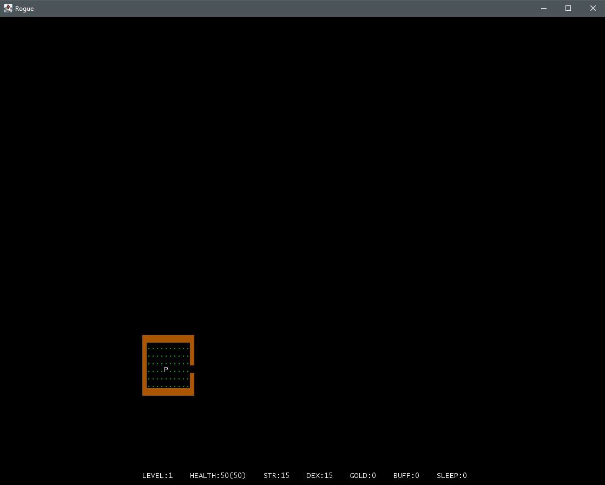
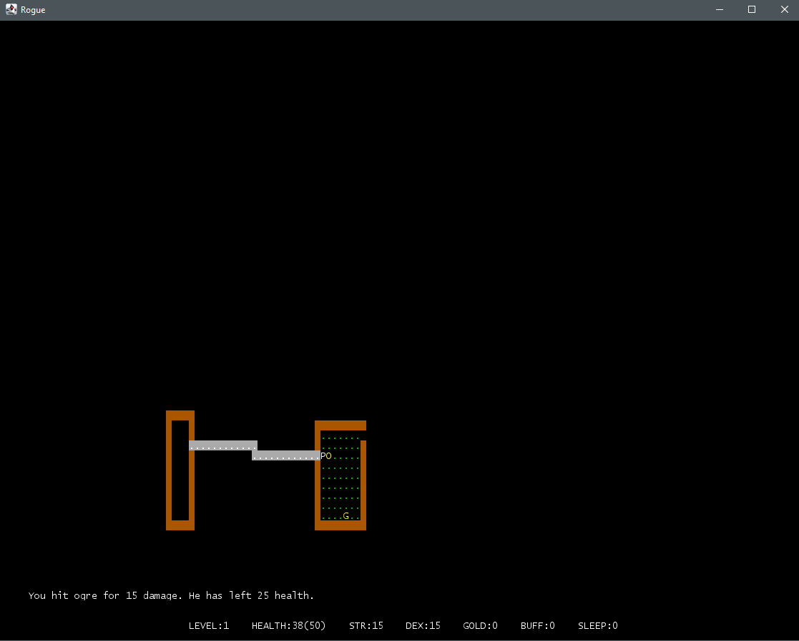
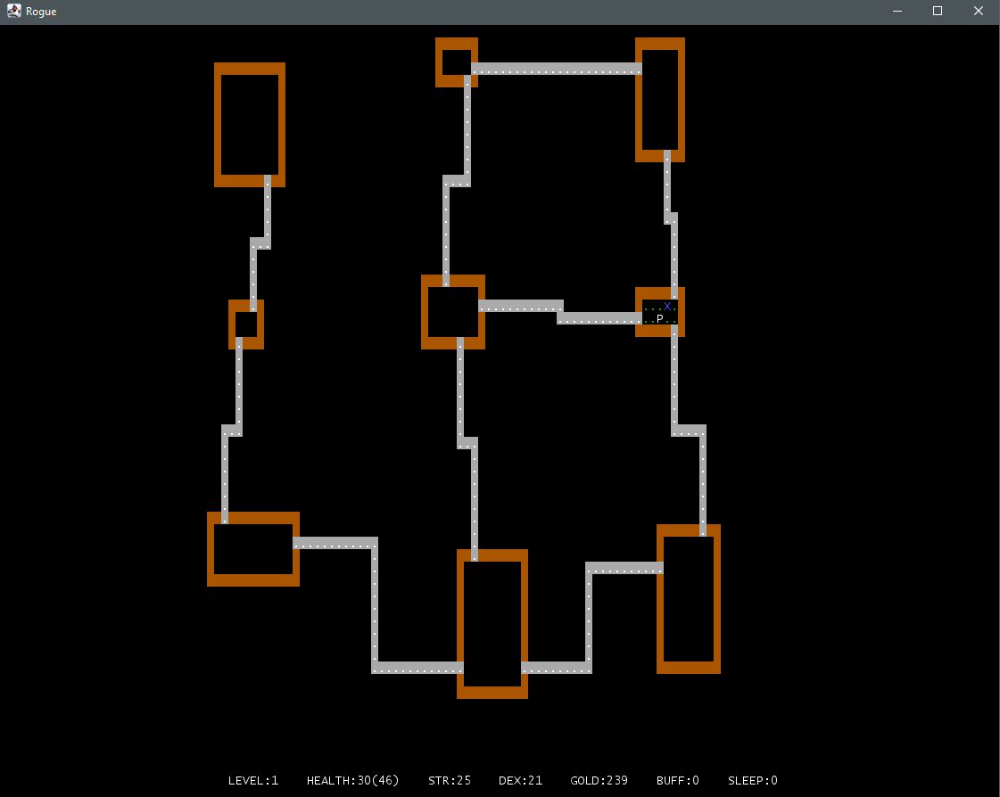
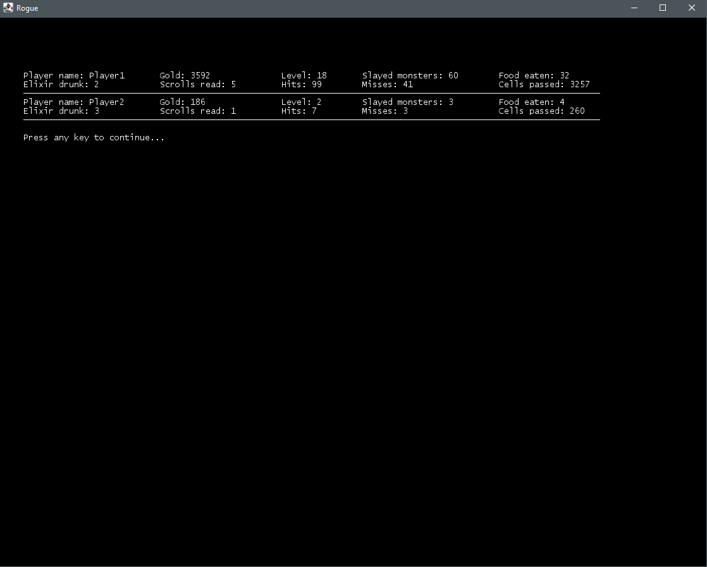

# Игра Rogue

Технологии: Java 18, lanterna 3.1.2.

## Описание

Игра roguelike, вдохновленная оригинальной игрой [Rogue](https://en.wikipedia.org/wiki/Rogue_(video_game)) 1980 года с
рядом упрощений. В игре предстоит исследовать подземелье, сражаться с монстрами и собирать добычу. Цель игры пройти 21
уровень подземелья и собрать максимальное количество золота.

### Логика игры

- Игра содержит 21 уровень с подземельями.
- Каждый уровень подземелья состоит из 9 комнат, соединенных коридорами.
- В каждой комнате могут находиться противники и предметы.
- Игрок управляет перемещением персонажа, может взаимодействовать с предметами и сражаться с противниками.
- Цель игрока — найти на каждом уровне переход (отображение: синий Х) на следующий уровень и таким образом пройти 21
  уровень.
- На каждом уровне игрок начинает в случайной позиции стартовой комнаты, где гарантированно отсутствуют противники.
- После смерти главного героя состояние игры сбрасывается и все возвращается к началу.
- С каждым новым уровнем повышается количество и сложность противников, снижается количество полезных предметов и
  повышается количество сокровищ.
- После любого прохождения (успешного и нет) результат игрока фиксируется в таблицу рекордов, где указывается
  достигнутый уровень подземелья и количество собранных сокровищ. Таблица рекордов сортируется по количеству
  сокровищ.
- Вся игра работает в пошаговом режиме (каждое действие игрока запускает действия противников).

### Логика персонажа

- Отображение: белое P.
- Характеристика здоровья персонажа показывает его текущий уровень здоровья, и когда здоровье персонажа достигает 0,
  игра заканчивается.
- Характеристика максимального уровня здоровья показывает максимальный уровень здоровья персонажа, который может
  быть восстановлен путем употребления еды.
- Характеристика ловкости участвует в формуле вычисления вероятности попадания противников по персонажу и персонажа по
  противникам, а также влияет на скорость перемещения по подземелью.
- Характеристика силы определяет базовый урон, наносимый персонажем без оружия, а также участвует в формуле вычисления
  урона при использовании оружия.
- За победу над противником персонаж получает количество золота, зависящее от сложности противника.
- Персонаж может поднимать предметы и складывать в свой рюкзак, а затем использовать их.
- Каждый предмет при использовании может временно или постоянно изменять одну из характеристик персонажа.
- При достижении выхода из уровня персонаж автоматически попадает на следующий уровень.

### Логика противников

- Каждый противник имеет аналогичные игроку характеристики здоровья, ловкости, скорости и силы, дополнительно к этому
  имеет характеристику враждебности.
- Характеристика враждебности определяет расстояние, с которого противник начинает преследовать игрока.
- 5 видов противников:
    + Зомби (отображение: зеленый z): Низкая ловкость. Средняя сила, враждебность. Высокое здоровье.
    + Вампир (отображение: красная v): Высокая ловкость, враждебность и здоровье. Средняя сила. Отнимает некоторое
      количество максимального уровня здоровья игроку при успешной атаке. Первый удар по вампиру — всегда промах.
    + Привидение (отображение: белый g): Высокая ловкость. Низкая сила, враждебность и здоровье. Постоянно
      телепортируется по комнате и периодически становится невидимым, пока игрок не вступил в бой.
    + Огр (отображение: желтый O): Ходит по комнате на две клетки. Очень высокая сила и здоровье, но после каждой атаки
      отдыхает один ход, затем гарантированно контратакует. Низкая ловкость. Средняя враждебность.
    + Змей-маг (отображение: белая s): Очень высокая ловкость. Ходит по карте по диагоналям, постоянно меняя сторону. У
      каждой успешной атаки есть вероятность «усыпить» игрока на один ход. Высокая враждебность.

### Логика окружения

- Каждый тип предмета имеет свое значение:
    + золото (накапливается и влияет на итоговый рейтинг);
    + еда (восстанавливает здоровье на некоторую величину);
    + эликсиры (временно повышают одну из характеристик: ловкость, силу, максимальное здоровье);
    + свитки (постоянно повышают одну из характеристик: ловкость, силу, максимальное здоровье);
    + оружие (имеют характеристику силы, при использовании оружия меняется формула вычисления наносимого урона).
- Когда персонаж наступает на предмет, он автоматически добавляется в рюкзак, если он неполон (в рюкзаке может
  храниться максимум 9 предметов каждого типа).
- Еда, эликсиры, свитки при использовании тратятся.
- Оружие при смене падает на пол, на соседнюю клетку.
- Каждый уровень подземелья имеет наполнение, зависящее от своего индекса:
    + Чем глубже уровень, тем он сложнее;
    + Уровень состоит из комнат;
    + Комнаты соединены коридорами;
    + Комнаты содержат противников и предметы;
    + Противники и персонаж могут перемещаться по комнатам и коридорам;
    + Каждый уровень имеет гарантированный переход на следующий уровень;
    + Выход из последнего уровня завершает игру.

### Логика боя

- Бой вычисляется в пошаговом режиме.
- Атака производится путем перемещения персонажа по направлению к противнику.
- Удары просчитываются по очереди, в несколько этапов:
    + 1 этап расчета удара — проверка на попадание. Проверка на попадание случайна и высчитывается из ловкости и
      скорости бьющего и цели удара;
    + 2 этап — расчет урона. Рассчитывается из силы и модификаторов (оружия);
    + 3 этап — применение урона. Урон вычитается из здоровья. Если здоровье падает до 0 или ниже, то противник или
      персонаж погибает;
- Из каждого противника при победе выпадает случайное количество золота, зависящее от враждебности, силы, ловкости и
  здоровья противника.

### Управление

- Управление персонажем:
    + Передвижение при помощи клавиш WASD.
    + Применение оружия из рюкзака при помощи кнопки h.
    + Применение аптечки из рюкзака при помощи кнопки j.
    + Применение эликсира из рюкзака при помощи кнопки k.
    + Применение свитка из рюкзака при помощи e.
    + Просмотр статистики i (не запускает действие игрока).
- Любое использование чего-либо из рюкзака приводит к печати списка предметов этого типа на экран с вопросом
  игроку, что нужно выбрать (1-9).

### Статистика

- В игре собирается и отображается в отдельном представлении статистика всех прохождений, отсортированная по количеству
  собранного золота: количество золота, достигнутый уровень, количество побежденных противников, количество съеденной
  еды, количество выпитых эликсиров, количество прочитанных свитков, количество нанесенных и пропущенных ударов,
  количество пройденных клеток.

### Сохранения

В игре реализован репозиторий, в котором производится сохранение и извлечение данных об игровом прогрессе игрока в
файле json.

- После прохождения каждого уровня происходит сохранение игрового прогресса и статистики.
- После перезапуска игры, если игрок выбирает продолжить последнюю сохраненную сессию, уровни генерируются в
  соответствии с сохраненной информацией, а прогресс игрока — полностью восстанавливаться (набранные очки, текущие
  значения характеристик), т. е. будет восстановлена вся информация об игровой сессии вплоть до расположения отдельных
  сущностей и их характеристик на момент сохранения.
- Также сохраняется статистика по всем попыткам прохождений, при просмотре таблицы лидеров отображаются лучшие
  попытки прохождения (успешные и нет).

## Примеры геймплея

* Появление в подземелье

* Бой с монстром

* Полностью разведанный уровень

* Окно статистики

## Запуск игры

Необходимые инструменты:

* [Java (JDK) 18;](https://github.com/corretto/corretto-18/releases)

### С помощью командной строки

Находясь в корневой папке проекта, выполнить:

Linux/macOS:

* ./mvnw clean package

Windows:

* mvnw.cmd package

После успешной сборки:

* javaw -jar target/rogue-1.0.jar

### С помощью среды разработки (IntelliJ IDEA, Eclipse, NetBeans)

* Найдите GameStarter в src/main/java
* Нажмите ▶️ рядом с классом (или Shift+F10 в IntelliJ IDEA)